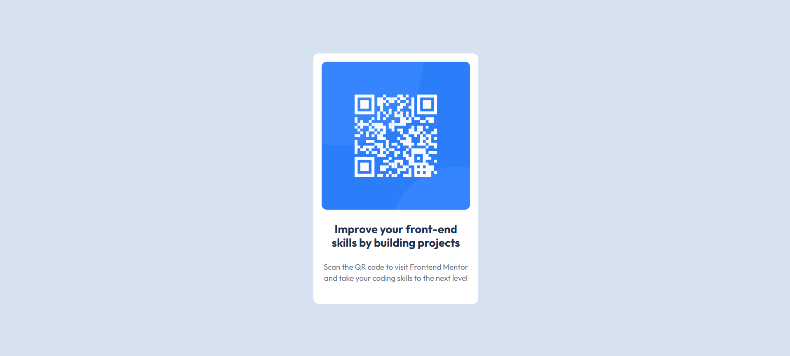

# Frontend Mentor - QR code component solution

This is a solution to the [QR code component challenge on Frontend Mentor](https://www.frontendmentor.io/challenges/qr-code-component-iux_sIO_H). Frontend Mentor challenges help you improve your coding skills by building realistic projects.

## Table of contents

- [Overview](#overview)
  - [Screenshot](#screenshot)
  - [Links](#links)
- [My process](#my-process)
  - [Built with](#built-with)
  - [What I learned](#what-i-learned)
  - [Continued development](#continued-development)
  - [Useful resources](#useful-resources)
- [Author](#author)

## Overview

### Screenshot



### Links

- Live Site URL: [Live Preview](https://rishabhsikka3.github.io/qr-code-design/)

## My process

### Built with

- Semantic HTML5 markup
- CSS custom properties (variables)
- Flexbox
- Mobile-first responsive design
- BEM naming convention

### What I learned

This challenge helped reinforce my understanding of writing clean and semantic HTML and using modern CSS techniques for layout and styling. I learned the importance of:

- Avoiding fixed heights to ensure components shrink/grow based on content and screen size.
- Making images responsive using `width: 100%; height: auto;`.
- Using `max-width` for elements to keep them within a design limit but still be fluid.
- Centering elements vertically and horizontally using Flexbox:

```css
.container {
  display: flex;
  justify-content: center;
  align-items: center;
  min-height: 100vh;
}
```

### Continued development

In future projects, I want to:

- Explore using CSS `clamp()` for more fluid typography.
- Implement theme switching (light/dark) using CSS variables.
- Improve accessibility by ensuring keyboard navigation and screen reader compatibility.

### Useful resources

- [MDN Web Docs - Flexbox](https://developer.mozilla.org/en-US/docs/Web/CSS/CSS_flexible_box_layout/Basic_Concepts_of_Flexbox)
- [Frontend Mentor - Community Solutions](https://www.frontendmentor.io/solutions)

## Author

- Name – Rishabh Sikka
- Frontend Mentor – [@RishabhSikka3](https://www.frontendmentor.io/profile/RishabhSikka3)
